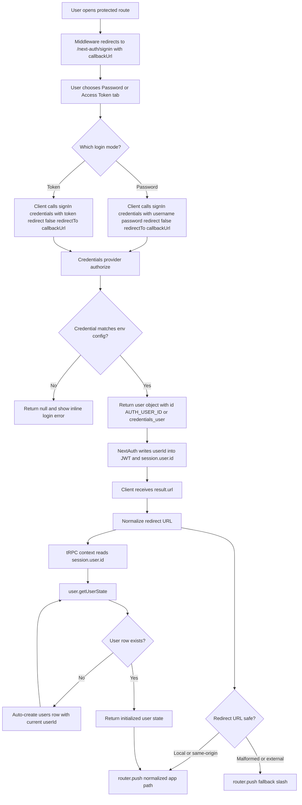

# Credentials Login Flow

This document describes the current LobeHub browser login flow when `NEXT_AUTH_SSO_PROVIDERS=credentials` is enabled.

## Overview

LobeHub uses a single NextAuth Credentials provider for both browser login tabs:

- Password tab: submits `username` + `password`
- Access Token tab: submits `token`
- Both successful paths authenticate as the same logical user id: `AUTH_USER_ID` if set, otherwise `credentials_user`

The login UI currently shows both tabs whenever the credentials provider is enabled. Whether a tab actually succeeds depends on whether its backing environment variables are configured.

## Validation Rules

- Password login succeeds only if `AUTH_CREDENTIALS_USERNAME` and `AUTH_CREDENTIALS_PASSWORD` are both configured and exactly match the submitted values.
- Token login succeeds only if `AUTH_TOKEN` is configured and matches the submitted value.
- Comparisons are performed with constant-time string checks.

## Post-Login Behavior

- NextAuth stores the authenticated user id in the JWT session.
- Backend tRPC context reads `session.user.id` and treats the request as authenticated.
- On the first authenticated `user.getUserState` call, if no `users` row exists yet, LobeHub auto-creates one and retries.
- The client then redirects to the saved `callbackUrl`.
- If NextAuth returns a local absolute URL such as `http://0.0.0.0:33210/chat`, the client normalizes it to an in-app path like `/chat` before navigation.
- If NextAuth returns a malformed or external absolute URL, the client falls back to `/`.

## Flow Diagram

## Practical Notes

- If you configure only `AUTH_CREDENTIALS_USERNAME` and `AUTH_CREDENTIALS_PASSWORD`, only the Password tab will succeed.
- If you configure only `AUTH_TOKEN`, only the Access Token tab will succeed.
- If you configure both, either tab signs in as the same underlying `AUTH_USER_ID`.
- Credentials login is session-based for the browser, but `AUTH_TOKEN` can also be reused as a Bearer token for API access.