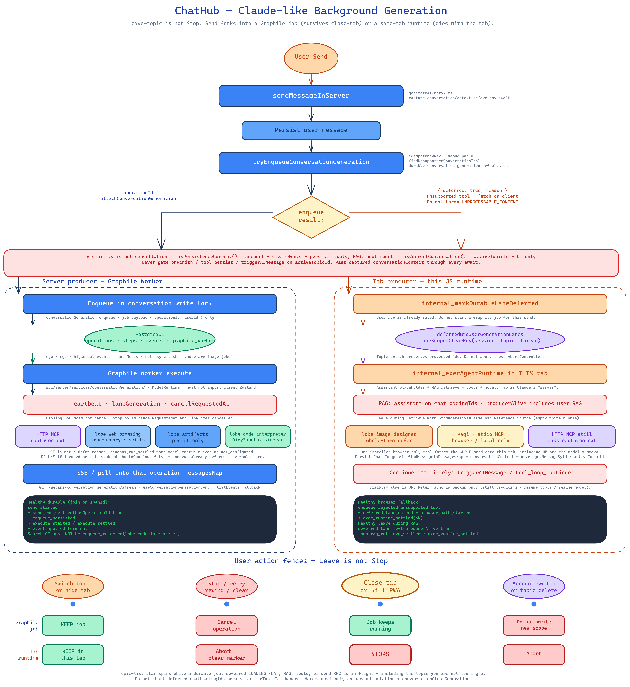
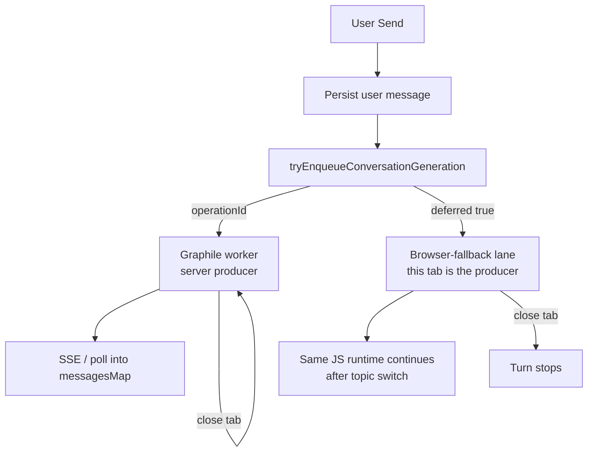
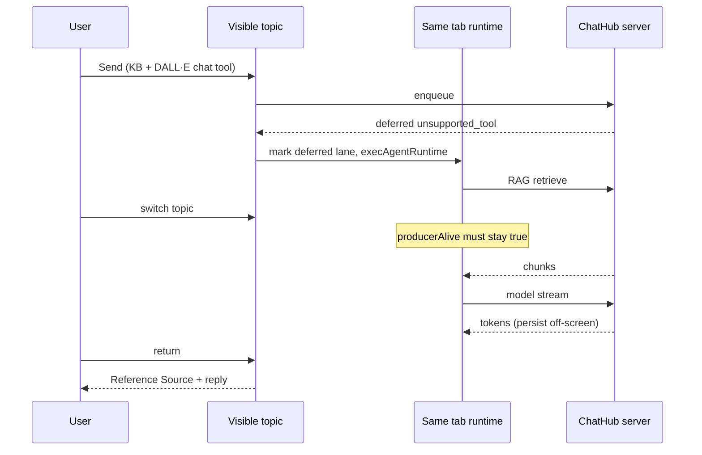

# Claude-like background generation — end-to-end lesson

This page records **how ChatHub approximates Claude.ai background chat**: the
user sends a message, leaves the topic, and the turn still runs (tools,
Knowledge Base / RAG, then the model summary) without requiring them to come
back first.

It is the maintainer / agent lesson. Implementation internals live in
[Durable conversation generation](durable-conversation-generation.md).
User-facing workflow lives in the GitHub Wiki
[Background Conversation Generation](https://github.com/lqdflying/chathub/wiki/Background-Conversation-Generation).
Agent contract: **`.cursor/rules/durable-background-generation.mdc`**.
Production log checks: **`.cursor/rules/debug-log-checks.mdc`**.

## What “Claude-like” means here

Claude.ai’s useful behavior is not “the UI stays open.” It is:

1. Send starts a **server-owned** turn.
2. Switching conversations, or putting the client in the background, does
   **not** mean Stop.
3. Tools and retrieval keep going. The model writes the summary when they
   finish.
4. Coming back shows progress or a finished reply — not an empty bubble.

The visual map of this fork, the two producers, and the Leave / Stop / close-tab fences:



Editable source: [`claude-like-background-generation.excalidraw`](claude-like-background-generation.excalidraw).

ChatHub splits that into **two producers**, because some installed tools cannot
run inside Graphile Worker:



Closing the browser or killing the PWA **must not** be described as equivalent
to Claude.ai’s server turn unless durable enqueue succeeded. For deferred
turns, the **tab** is Claude’s “server.”

## Why not one path

| Constraint | Consequence |
|------------|-------------|
| Self-hosted Docker + PostgreSQL only | Jobs live in Graphile’s `graphile_worker` schema + ChatHub operation tables. No Redis, no `async_tasks` for chat. |
| Some tools need the browser (image-designer canvas, Kagi, stdio MCP) | Worker must **refuse** those tools rather than invent a result. The client saves the user row and runs `internal_execAgentRuntime`. Code Interpreter is **not** in this set: Graphile calls the DifySandbox sidecar. |
| Next.js `next build` | Worker code must not import the client AI-infra Zustand store (React hooks in a server graph). |
| Multi-tab / mobile Back / PWA | Leave, hide, and Stop are different fences. Navigation bumps `conversationNavigationGeneration`. Stop / clear / account switch bump `conversationClearGeneration` (lane- or topic-scoped). |

## End-to-end send path

### 1. Client send (`sendMessageInServer`)

`src/store/chat/slices/aiChat/actions/generateAIChatV2.ts`

1. Capture `conversationContext` (session, topic, thread, **clear fence**,
   navigation generation) **before** any await.
2. Persist the user message.
3. Call `tryEnqueueConversationGeneration` with a request-scoped
   `idempotencyKey` and `debugSpanId`.
4. Branch on the result:

| Enqueue result | Client next step |
|----------------|------------------|
| Operation with `id` | `attachConversationGeneration`, SSE/poll. Do **not** start `internal_execAgentRuntime`. |
| `{ deferred: true, reason, toolName }` | `internal_markDurableLaneDeferred`, create assistant placeholder, `internal_execAgentRuntime`. |
| Flag off / missing server-reachable key | Same as deferred (`fetch_on_client`). User message still saved. |

Expected browser-only tools return **structured deferral**, not
`UNPROCESSABLE_CONTENT`. Throwing dumps tRPC stacks on V1 / regenerate / group
paths.

### 2. Server producer (durable)

```
Browser → enqueue API → PostgreSQL (message + operation + Graphile job)
       → Graphile Worker → ModelRuntime + HTTP tools + MCP
       → checkpoint messages/events
Browser → SSE/poll → dispatch into that operation’s messagesMap
```

Closing SSE does not cancel the job. Stop sets `cancelRequestedAt`. The worker
polls it and finalizes `cancelled`.

Lanes are unique while `pending` / `processing`. Title, translation,
compaction, TTS, and RAG families do not cancel an in-flight reply. Chat /
continue / regenerate / group supervisor / group agent share the chat Stop
family but not replacement lanes for parallel group members.

Details: tables, sweeper, heartbeats, lane generation, attach fences — see
[Durable conversation generation](durable-conversation-generation.md).

### 3. Tab producer (browser-fallback)

Used when enqueue reason is `unsupported_tool` or `fetch_on_client`. Typical
`toolName` values: `lobe-image-designer`, `kagi`, non-HTTP MCP. Enabling Code
Interpreter (`lobe-code-interpreter`) does **not** defer the turn; Graphile
runs it on the DifySandbox sidecar (`sandbox_run_settled`) and continues.

Prompt-only builtins with an empty `api` (Artifacts / `lobe-artifacts`) are
**not** deferred: the worker already injects the system prompt.

While the tab stays alive:

1. Mark `deferredBrowserGenerationLanes` keyed by
   `laneScopedClearKey(sessionId, topicId, threadId)`.
2. Topic **or session** switch calls `internal_invalidateConversation` which
   **preserves** protected message ids (assistant, user RAG row, in-flight
   tool children) and does **not** abort those AbortControllers.
3. RAG retrieve, builtin tools, and HTTP MCP run under the **hard-cancel**
   fence (account snapshot + clear generation), not `activeTopicId` /
   `activeId`.
4. When a step finishes, **continue the model immediately**
   (`triggerAIMessage` / `tool_loop_continue`) with the original
   `conversationContext`, even if `visible=false` or the UI is on another
   session (do not skip with `session_changed` for a deferred lane).
5. Return-sync (`syncActiveConversationGenerations`) is a **backup**:
   `still_producing` if the continue already started; `resume_tools` /
   `resume_model` only if it was skipped; never blank a leftover
   `LOADING_FLAT` row.



## Persistence vs visibility (the core bug class)

Two predicates look similar and must not be swapped:

| Predicate | Includes topic visibility? | Use for |
|-----------|----------------------------|---------|
| `isPersistenceCurrent()` | No — account + clear fence | Persist assistant text, tool results, RAG metadata, start the next model call |
| `isCurrentConversation()` | Yes — `activeId` / `activeTopicId` | Refresh the **visible** list, context-export UI, attach toast |

Pass **captured** `conversationContext` through fetch, tools, RAG
(`internal_updateMessageRAG`), and `internal_updateMessageContent`. If a
helper omits it, infer the inactive `messagesMap` hit by message id.

`onFinish` used to require `isCurrentConversation()`. Leave during stream
discarded the reply, left `LOADING_FLAT`, and
`InterruptibleLoading` hid the bubble after 8s (empty white circle).

## Knowledge Base / RAG on the tab producer

Chat RAG is **not** a Graphile tool step on the browser-fallback path. V2
retrieves **after** the assistant placeholder exists, then starts the model.

Production hang (2026-08-21): retrieve finished off-screen (`rag_retrieve_settled
ok`, 8 chunks) but leave logged `deferred_lane_left(producerAlive=false)`
because RAG loading lived on the **user** row (`messageRAGLoadingIds`) while
the assistant was not on `chatLoadingIds`. The placeholder went stale.

Fix:

- `internal_execAgentRuntime` toggles **assistant** chat loading for the whole
  retrieve + model path.
- `isDeferredLaneProducerAlive` is true when protected user RAG ids are
  loading, not only when the assistant is in `chatLoadingIds`.
- Healthy leave during retrieve: `producerAlive=true`, then
  `exec_runtime_settled(ok)` (verified on `v1.0.27-canary.16`).

Server-side chat RAG for **durable** turns is injected from the worker using
the same dedicated embedding provider. See
[Knowledge Base and vector RAG](knowledge-base-rag.md).

## Tools on each producer

| Capability | Durable worker | Browser-fallback tab |
|------------|----------------|----------------------|
| HTTP MCP (incl. OAuth tokens in Postgres) | Yes | Yes — pass `oauthContext` on every tRPC procedure |
| Online Search (`lobe-web-browsing`) | Yes | Yes (`builtin_tool_settled`) |
| Artifacts | Yes (prompt only) | Not a defer reason |
| Code interpreter | **No** | Yes — defers the **whole turn** |
| Image-designer / DALL·E chat tools | **No** | Yes — defers the whole turn |
| Kagi | **No** | Yes |
| Non-HTTP MCP | **No** | Yes |

A single installed browser-only tool forces the **entire** send onto the tab
producer, including KB retrieval and the model summary.

After MCP/builtin results: do not rewrite `completed` as `cancelled` on
navigation; clear `messageInToolsCallingIds` in `finally`; continue the model
in the same turn (`tool_loop_continue`, `visible=false` is OK).

## Stop, leave, close, delete

| User action | Fence | Durable | Deferred tab |
|-------------|-------|---------|--------------|
| Switch topic / session / thread | Navigation generation | Keep job; SSE still applies to **operation** map | Preserve producers; continue immediately |
| Hide tab (`visibilitychange`) | Same as leave | Keep job | Keep runtime; `deferred_lane_left(type=visibility)` |
| Stop | Lane-scoped clear epoch (chat family) | Cancel operation | Abort controllers, delete empty `LOADING_FLAT` |
| Clear conversation / all history | Topic- or session-wide tombstone + global clear | Cancel in scope | Abort |
| Topic delete | Topic tombstone **before** first await | Cancel matching ops | Abort deferred lanes for that topic |
| Close tab | None on the client | Job continues | **Stops** |
| Account switch | Account mutation snapshot | Do not write into the new scope | Abort |

Topic-list **star spins** while a durable job, deferred `LOADING_FLAT`, RAG,
tools, or send RPC is in flight — including the topic the user is not looking
at.

## Production diagnosis (Axiom `chathub`)

Join one turn on `spanId` (`gd_…`). Never log message text.

**Healthy durable send:**
`send_started` → `send_rpc_settled(hasOperationId=true)` → `enqueue_persisted`
→ `execute_started` / `execute_settled` → client `event_applied_terminal`.
Search-only with Code Interpreter enabled must **not** be
`enqueue_rejected` / `toolName=lobe-code-interpreter`.

**Healthy browser-fallback send:**
`enqueue_rejected(unsupported_tool)` → `deferred_lane_marked` →
`browser_path_started` → work → `exec_runtime_settled(ok)`.

**Healthy leftover tab stream death (Safari `Load failed`):**
`fetch_stream_interrupted(errorKind=webkit_load_failed, classifiedAs=abort)`
on the continue `spanId`. Must **not** be `fetch_stream_error` /
`UnknownChatFetchError`. Continue fetches also emit
`exec_runtime_settled(kind=continue)`.

**Worker actually called Code Interpreter:**
`sandbox_run_settled(outcome=ok|error|timeout|unavailable|not_configured)`
then the model continue. CI must **not** emit `browser_tool_stubbed`.

**Healthy leave during RAG:**
`deferred_lane_left(producerAlive=true)` + `rag_retrieve_settled(ok|empty)`
then `exec_runtime_settled`. **`producerAlive=false` + retrieve ok** is the
empty Reference Source hang.

**Healthy leave during tools:**
`invalidate_preserved` (preserved plugin/RAG/chat counts) →
`call_tool_complete` / `builtin_tool_settled` → `tool_loop_continue`
(`visible=false`). `tool_loop_continue_skipped(reason=session_changed)` after
a successful tool is a regression.

`CHATHUB_GENERATION_DEBUG=1` and `CHATHUB_KNOWLEDGE_DEBUG=1` are the switches.
Chat Image tile create/persist/attach is on generation-debug (`chat_image_*`),
not `CHATHUB_IMAGE_DEBUG` (that switch is the `/image` workspace).
Copy-paste APL: **`.cursor/rules/debug-log-checks.mdc`**.

## Lessons learned (do not re-introduce)

1. **Visibility is not cancellation.** Gating persist or the next model call
   on `activeTopicId` recreates Claude’s opposite: leave kills the turn.
2. **Immediate continue beats return-sync.** Waiting for the user to come back
   after Tavily/MCP/RAG produces “JSON landed, no summary.” Continue in the
   same tab as soon as the step settles.
3. **Loading flags must match the UI row.** RAG on the user id with a
   `LOADING_FLAT` assistant that is not in `chatLoadingIds` looks like a dead
   producer. Put the assistant on chat loading for retrieve + fetch.
4. **Deferral is a successful RPC.** Do not throw for expected browser-only
   tools. Mark the lane as soon as `assistantMessageId` exists (send-RPC race
   before the marker is still a known gap).
5. **OAuth MCP is dead without `oauthContext`.** Token getter and 401 retry
   never run otherwise (`.cursor/rules/mcp-oauth.mdc`).
6. **Worker ≠ image `async_tasks`.** Different lifecycle; do not share tables.
7. **Orphan `LOADING_FLAT` cleanup** repairs pre-fix empty bubbles on next
   open; it is not a substitute for persisting off-screen.
8. **iOS truncated topic titles** can show a centered black overlay when the
   user taps the header to leave; that is WebKit ellipsis preview, not a
   generation cancel. Header text uses pointer-events + `::after` to disable
   it. Unrelated to Graphile.
9. **Chat Image tool must not use `getMessageById` / `activeTopicId` for
   persist.** `chatSelectors.getMessageById` reads only the visible map.
   After leave, that returns `undefined` and `updateImageItem` silently
   no-ops — one tile can finish while others stay Prompt-only. Resolve the
   tool row with `findMessageInMessagesMap`, pin `conversationContext` from
   that map key, and return `{ outcome: 'completed' }` from `text2image` so
   `invokeBuiltinTool` does not log a successful void return as `skipped`.
   Safari `Load failed` during **model think** (empty stream, tools never
   started) is a separate WebKit abort; do not treat it as this persist bug.
   With `CHATHUB_GENERATION_DEBUG=1`, join `chat_image_run_started` /
   `chat_image_item_settled` / `chat_image_run_settled` (and server
   `chat_image_task_created`) on the send `spanId`. No `chat_image_run_started`
   after `webkit_load_failed` is the Safari-before-tools case;
   `persist_unproven` or missing `attached` after `visible=false` is persist.
10. **Stale `getMessages` must not drop chat Image `imageId`.** Generation
    writes the file to Artifacts independently of the tool-message JSON.
    `useFetchMessages` onSuccess used to replace the map with a fetch that
    started before persist (SWR mutation race / overlapping refresh). Merge
    file and task ids on fetch as one versioned attempt tuple (a stale Stop
    snapshot must not replace a newer Retry), including tool rows that omit
    `plugin` when the in-memory row is Chat Image. An explicit non-image
    plugin is never treated as Chat Image. Prompt-only remount adopts the
    saved file from a 1:1 `messages_files` link, then `getChatImageSlotResult`
    (latest attempt for that prompt, including historical derived task ids),
    then attempt-0 alias probes — never auto-creating, and never assigning
    `imageList[index]` on a multi-prompt card. A pending later attempt is
    polled until it produces the file. Same-attempt scope aliases prefer a
    live task over a terminal failure. The owned message item's stored
    `taskId`/`taskAttempt` and completed files with slot keys have no Retry
    ceiling; wiped JSON without those keys is discoverable only for attempts
    0–256. One terminal legacy id cannot hide a successful file.
    The Image tool renderer reads the live store rather than a stale parsed
    `content` prop, and re-runs reconcile when tiles become prompt-only
    again. `attachedCount=N` with Prompt-only cards is this wipe, not a failed
    generation.

## How to extend this without breaking it

When adding a tool, retrieval step, or send-path gate:

1. Decide the **producer**: can Graphile run it with server-reachable
   credentials and no browser API? If the tool is only *enabled* but the
   worker can run it (Code Interpreter on DifySandbox), keep the turn on
   Graphile. If the whole turn needs a browser API (DALL·E, Kagi, stdio MCP),
   defer the **whole turn**.
2. Capture `conversationContext` at start; thread it through every await.
3. On leave, keep AbortControllers and loading ids for protected messages.
4. When the step settles, continue the model immediately if the deferred lane
   (or durable job) still owns that assistant.
5. Add a test that **switches `activeTopicId` during the step** and asserts
   persist / continue, not cancel.
6. Emit a generation-debug event on the send `spanId` (`outcome` enum, hashed
   ids, `visible`, `producerAlive`). Check it in Axiom before calling the
   path healthy.
7. Update this lesson, the durable internals page, the GitHub Wiki if users
   see a new workflow, and **`.cursor/rules/debug-log-checks.mdc`** if events
   changed.

## Key source map

| Concern | Location |
|---------|----------|
| Send + RAG + exec | `src/store/chat/slices/aiChat/actions/generateAIChatV2.ts` |
| Stream persist / fetch | `src/store/chat/slices/aiChat/actions/generateAIChat.ts` |
| Deferred lanes / sync / leave | `src/store/chat/slices/aiChat/actions/conversationGeneration.ts` |
| Invalidate / preserve ids | `src/store/chat/slices/message/action.ts` |
| Protected ids / producerAlive | `src/store/chat/utils/deferredBrowserGeneration.ts` |
| RAG retrieve fence | `src/store/chat/slices/aiChat/actions/rag.ts` |
| Enqueue helper | `src/helpers/durableConversationGeneration.ts` |
| Worker execute | `src/server/services/conversationGeneration/` |
| SSE | `src/hooks/useConversationGenerationSync.ts` |
| Empty bubble UI | `src/features/Conversation/Messages/Default.tsx` |
| Topic spinner | `src/store/chat/slices/topic/selectors.ts` |
| Chat Image tool persist | `src/store/chat/slices/builtinTool/actions/dalle.ts` |

High-signal tests are listed at the end of
[Durable conversation generation](durable-conversation-generation.md).
Always include
`src/store/chat/slices/aiChat/actions/__tests__/generateAIChatV2.test.ts`
and `conversationGeneration.test.ts` for leave-during-step changes.
