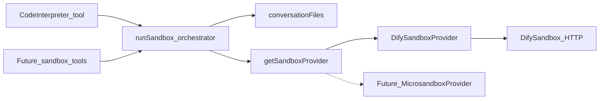

# Sandbox providers

Code Interpreter (and any later sandbox tools) call a **stateless**
`SandboxProvider.run()`. ChatHub gathers conversation files, the provider
executes, ChatHub persists outputs. The current implementation is DifySandbox
only.

## Interface

`src/server/services/sandbox/types.ts` defines `SandboxProvider`:

- `id`
- `isConfigured()`
- `run(input)` — `language` (`python3` today), `code`,
  `files: { filename, content: Uint8Array }[]`, `enableNetwork`, `timeoutMs`,
  plus debug-only `operationHash` / `packageCount`

Result: `success`, `stdout`, `stderr`, `files`, `outcome`
(`ok` / `error` / `timeout` / `unavailable` / `not_configured`), optional
`httpStatus` / `exitCode` / `durationMs`. For Dify, `success` is wrapper
sentinel present **and** `success: true` in that JSON. Process stderr
(`data.error`) is still returned; library warnings must not fail the tool.

Do **not** put VM handles, `/dev/kvm`, or Dify envelope tokens on this
interface. Those belong inside a provider.

`SANDBOX_PROVIDER` selects the backend (default `dify`). An unknown id returns
a stub that throws `not_configured` so ChatHub still boots.

## Dify (only implementation)

`src/server/services/sandbox/providers/dify/` owns:

- Official `POST /v1/sandbox/run` + `X-Api-Key` + envelope `code === 0`
- Wrapping files into the Python string (Dify has no session/file API)

Transport settings stay `CODE_INTERPRETER_SANDBOX_URL` /
`CODE_INTERPRETER_SANDBOX_API_KEY` / timeout / file caps so existing Compose
does not break.

The Code Interpreter tool adapter is still
`src/server/services/codeInterpreter/index.ts`: gather →
`getSandboxProvider().run()` → persist → `CodeInterpreterResponse`. Graphile
and leftover tRPC keep calling `runCodeInterpreter`.

## Conversation files

`conversationFiles.ts` is ChatHub-side, not provider-specific:

1. Page `MessageModel.query` **newest-first** (`order: 'desc'`, `pageSize`
   1000) until the file cap is filled, a short page, or 50 pages.
2. Scope with `loadConversationThreadMessages` (unset `threadId` = main topic
   only; a portal thread is that thread plus its main prefix, not sibling
   threads).
3. Walk **newest → oldest**. Duplicate basenames keep the newest file.
4. Persist outputs with the server file service.

## Dify working directory

DifySandbox `0.2.15` chroots to `/var/sandbox/sandbox-python` and runs each
request as a pooled UID (10,000–10,999). Guest `/tmp` is the chroot’s `tmp`
directory.

Dify’s Python seccomp list **does not allow** `mkdir`/`mkdirat` (they return
errno via `ActErrno`) and **kills** the process on `chdir`/`unlink`
(`ActKillProcess`). ChatHub therefore creates `/tmp/chathub-ci-<token>` with
mode `0700` in Dify **`preload`**, which runs as **root before** chroot,
seccomp, and setuid
([prescript.py](https://github.com/langgenius/dify-sandbox/blob/0.2.15/internal/core/runner/python/prescript.py),
[syscalls_amd64.go](https://github.com/langgenius/dify-sandbox/blob/0.2.15/internal/static/python_syscall/syscalls_amd64.go)).
Dify **0.2.10+ discards** the HTTP `preload` field unless the sidecar sets
`ENABLE_PRELOAD=true` (default is false)
([python.go](https://github.com/langgenius/dify-sandbox/blob/0.2.15/internal/service/python.go)).
That flag is required for ChatHub isolation. ChatHub generates `preload`
(hex-token mkdir + chown only); it never puts model or user code there. Keep
port `8194` unpublished.

The guest wrapper only probe-writes that directory, patches `open` /
`io.open` / `getcwd` so relative paths stay inside it (stdlib `zipfile`
uses `io.open`, which is only an alias for builtin `open` at interpreter
start
([io.open](https://docs.python.org/3.14/library/io.html#io.open),
[zipfile](https://github.com/python/cpython/blob/3.14/Lib/zipfile/__init__.py))),
and must not call `os.makedirs`, `os.chdir`, or `os.remove`. It also sets `TMPDIR`, `HOME`, `MPLCONFIGDIR`,
`XDG_CONFIG_HOME`, and `XDG_CACHE_HOME` to that directory, plus
`MPLBACKEND=Agg` (forced, not `setdefault`), `MPL_IGNORE_SYSTEM_FONTS=1`,
`OMP_NUM_THREADS` / `OPENBLAS_NUM_THREADS` / `MKL_NUM_THREADS` = `1`
([NumPy global state](https://numpy.org/doc/stable/reference/global_state.html)),
and `FONTCONFIG_FILE` / `FONTCONFIG_PATH` to an empty
`<fontconfig><reset-dirs/></fontconfig>` in the session dir
([fonts-conf](https://www.freedesktop.org/software/fontconfig/fontconfig-user.html)).
It replaces `subprocess.Popen` with a stub that raises `FileNotFoundError`
immediately, returns 127 from `os.system`, and stubs `os.fork` /
`os.posix_spawn` / `_posixsubprocess.fork_exec` the same way.
`threading.Timer` is a no-op: matplotlib 3.11 `FontManager.__init__` starts a
5s warning timer, and without `clone3` that `Thread.start()` blocks until the
60s abort
([font_manager.py](https://github.com/matplotlib/matplotlib/blob/v3.11.1/lib/matplotlib/font_manager.py)).
`os.unlink` / `os.remove` / `pathlib.Path.unlink` are no-ops because Dify
0.2.15 **kills** on `unlink`; matplotlib’s font-cache lock
(`cbook._lock_path`) would otherwise SIGSYS right after the font scan
([cbook.py](https://github.com/matplotlib/matplotlib/blob/v3.11.1/lib/matplotlib/cbook.py)).
Font-cache files (`fontlist-v*`, `*.matplotlib-lock`) are not returned as
chat outputs.
Matplotlib otherwise spawns `fc-list` on `import pyplot`
([font_manager.py](https://github.com/matplotlib/matplotlib/blob/v3.11.1/lib/matplotlib/font_manager.py),
[matplotlib#28488](https://github.com/matplotlib/matplotlib/issues/28488)).
Dify 0.2.15 can allow `clone3`/`pipe2`/`posix_spawn` while still killing
`execve`, so a real child hangs the parent on the pipe until ChatHub’s 60s
`AbortSignal`. Env-only (`MPL_IGNORE_SYSTEM_FONTS`) was not enough on
canary.21; a Python `Popen` stub was not enough on canary.22
(`import matplotlib` ~350ms, isolated `import pyplot` still 60s). Bundled
matplotlib fonts still work; guest code cannot run binaries. Do not fall back to a shared `/mnt/data` or the
jail `/`. Leftover per-run dirs are not deleted (unlink is blocked); they are
unique per token and go away when the sidecar is recreated.

Do **not** import matplotlib (or pandas) in the wrapper prologue. Dify
seccomp `ActKillProcess` is not a Python `Exception`; once those wheels are
copied into the chroot, an eager import kills `print("hello")` with
`error: operation not permitted` and empty stdout
([FAQ](https://github.com/langgenius/dify-sandbox/blob/0.2.15/FAQ.md),
[dify#30625](https://github.com/langgenius/dify/issues/30625)). Patch
`plt.show()` only after pyplot has finished loading (`savefig` / `close` /
`get_fignums` exist). An earlier `matplotlib.*` import during `pyplot.py`
exec would otherwise bind `show` on a partial module, then `def show`
overwrites it
([pyplot.py](https://github.com/matplotlib/matplotlib/blob/v3.11.1/lib/matplotlib/pyplot.py)).
`plt.show()` saves every open figure then closes it so a later plot is a
new PNG and the final flush cannot overwrite it with an empty chart. In-place edits of input files are returned; unchanged inputs are
not. Non-zero `SystemExit` is a failed run.

## Local jail reproduction

Wrapper, preload, or sidecar syscall/`ENABLE_*` changes must be proven on a
local `langgenius/dify-sandbox:0.2.15` replica (`127.0.0.1` only, same
`ALLOWED_SYSCALLS` / `ENABLE_PRELOAD` as the target) via `POST /v1/sandbox/run`
with ChatHub `wrapSandboxPython`. Host Python and unconstrained `docker exec`
are not the jail. Agent rule:
`.cursor/rules/code-interpreter-sandbox-repro.mdc`.

## Future backends

A later Microsandbox (or similar) provider can create/write/exec/destroy a
microVM **inside** `run()` without changing Code Interpreter or Graphile.
ChatHub remains distroless Node; that backend would be a sibling process, not
an in-process libkrun embed.

## Prompt layering

The builtin Code Interpreter `systemRole`
(`src/tools/code-interpreter/index.ts`) is **product-level sandbox contract**
only: timeout, cwd files by basename, matplotlib Agg, prefer office/data
libraries **when installed**, no per-request pip. Do not add operator-specific
jobs (Excel SOP, OpenAI SDK, …) there.

| Need | Where |
| --- | --- |
| Extra PyPI imports | Sidecar `/dependencies/python-requirements.txt`, then recreate |
| Standing specialty | That assistant’s system prompt (Agent Setting) |
| One-off task | User message or a Skill — topics have **no** system-prompt field |
| ChatHub LLM API keys | Stay on the ChatHub container; they are **not** injected into guest Python |

Agent rule: `.cursor/rules/code-interpreter-prompt.mdc`.

User-facing setup:
[Code Interpreter Sandbox](https://github.com/lqdflying/chathub/wiki/Code-Interpreter-Sandbox).
