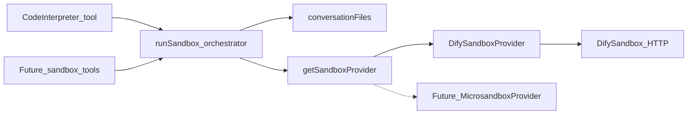

# Sandbox providers

Code Interpreter (and any later sandbox tools) call a **stateless**
`SandboxProvider.run()`. ChatHub gathers conversation files, the provider
executes, ChatHub persists outputs. The current implementation is DifySandbox
only.

## Interface

`src/server/services/sandbox/types.ts` defines `SandboxProvider`:

- `id`
- `isConfigured()`
- `run(input)` — `language` (`python3` today), `code`,
  `files: { filename, content: Uint8Array }[]`, `enableNetwork`, `timeoutMs`,
  plus debug-only `operationHash` / `packageCount`

Result: `success`, `stdout`, `stderr`, `files`, `outcome`
(`ok` / `error` / `timeout` / `unavailable` / `not_configured`), optional
`httpStatus` / `exitCode` / `durationMs`.

Do **not** put VM handles, `/dev/kvm`, or Dify envelope tokens on this
interface. Those belong inside a provider.

`SANDBOX_PROVIDER` selects the backend (default `dify`). An unknown id returns
a stub that throws `not_configured` so ChatHub still boots.

## Dify (only implementation)

`src/server/services/sandbox/providers/dify/` owns:

- Official `POST /v1/sandbox/run` + `X-Api-Key` + envelope `code === 0`
- Wrapping files into the Python string (Dify has no session/file API)

Transport settings stay `CODE_INTERPRETER_SANDBOX_URL` /
`CODE_INTERPRETER_SANDBOX_API_KEY` / timeout / file caps so existing Compose
does not break.

The Code Interpreter tool adapter is still
`src/server/services/codeInterpreter/index.ts`: gather →
`getSandboxProvider().run()` → persist → `CodeInterpreterResponse`. Graphile
and leftover tRPC keep calling `runCodeInterpreter`.

## Conversation files

`conversationFiles.ts` is ChatHub-side, not provider-specific:

1. Page `MessageModel.query` **newest-first** (`order: 'desc'`, `pageSize`
   1000) until the file cap is filled, a short page, or 50 pages.
2. Scope with `loadConversationThreadMessages` (unset `threadId` = main topic
   only; a portal thread is that thread plus its main prefix, not sibling
   threads).
3. Walk **newest → oldest**. Duplicate basenames keep the newest file.
4. Persist outputs with the server file service.

## Dify working directory

DifySandbox `0.2.15` chroots to `/var/sandbox/sandbox-python` and runs each
request as a pooled UID (10,000–10,999). Guest `/tmp` is the chroot’s `tmp`
directory.

Dify’s Python seccomp list **does not allow** `mkdir`/`mkdirat` (they return
errno via `ActErrno`) and **kills** the process on `chdir`/`unlink`
(`ActKillProcess`). ChatHub therefore creates `/tmp/chathub-ci-<token>` with
mode `0700` in Dify **`preload`**, which runs as **root before** chroot,
seccomp, and setuid
([prescript.py](https://github.com/langgenius/dify-sandbox/blob/0.2.15/internal/core/runner/python/prescript.py),
[syscalls_amd64.go](https://github.com/langgenius/dify-sandbox/blob/0.2.15/internal/static/python_syscall/syscalls_amd64.go)).
The guest wrapper only probe-writes that directory, patches `open`/`getcwd` so
relative paths stay inside it, and must not call `os.makedirs`, `os.chdir`, or
`os.remove`. Do not fall back to a shared `/mnt/data` or the jail `/`.
Leftover per-run dirs are not deleted (unlink is blocked); they are unique per
token and go away when the sidecar is recreated.

Matplotlib `plt.show()` closes the figure after saving so the final flush
cannot overwrite it with an empty chart. In-place edits of input files are
returned; unchanged inputs are not. Non-zero `SystemExit` is a failed run.

## Future backends

A later Microsandbox (or similar) provider can create/write/exec/destroy a
microVM **inside** `run()` without changing Code Interpreter or Graphile.
ChatHub remains distroless Node; that backend would be a sibling process, not
an in-process libkrun embed.

## Prompt layering

The builtin Code Interpreter `systemRole`
(`src/tools/code-interpreter/index.ts`) is **product-level sandbox contract**
only: timeout, cwd files by basename, matplotlib Agg, prefer office/data
libraries **when installed**, no per-request pip. Do not add operator-specific
jobs (Excel SOP, OpenAI SDK, …) there.

| Need | Where |
| --- | --- |
| Extra PyPI imports | Sidecar `/dependencies/python-requirements.txt`, then recreate |
| Standing specialty | That assistant’s system prompt (Agent Setting) |
| One-off task | User message or a Skill — topics have **no** system-prompt field |
| ChatHub LLM API keys | Stay on the ChatHub container; they are **not** injected into guest Python |

Agent rule: `.cursor/rules/code-interpreter-prompt.mdc`.

User-facing setup:
[Code Interpreter Sandbox](https://github.com/lqdflying/chathub/wiki/Code-Interpreter-Sandbox).
