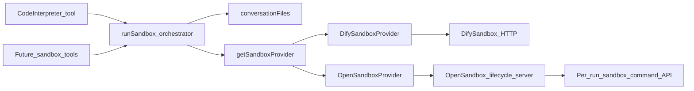

# Sandbox providers

Code Interpreter (and any later sandbox tools) call a **stateless**
`SandboxProvider.run()`. ChatHub gathers conversation files, the provider
executes, ChatHub persists outputs. Two backends exist: DifySandbox (default)
and OpenSandbox.

```mermaid
flowchart LR
  ciTool[CodeInterpreter_tool]
  other[Future_sandbox_tools]
  orch[runSandbox_orchestrator]
  files[conversationFiles]
  registry[getSandboxProvider]
  dify[DifySandboxProvider]
  osb[OpenSandboxProvider]
  sidecar[DifySandbox_HTTP]
  osbServer[OpenSandbox_lifecycle_server]
  sandbox[Per_run_sandbox_command_API]

  ciTool --> orch
  other --> orch
  orch --> files
  orch --> registry
  registry --> dify
  registry --> osb
  dify --> sidecar
  osb --> osbServer
  osbServer --> sandbox
```

## Interface

`src/server/services/sandbox/types.ts` defines `SandboxProvider`:

- `id`
- `isConfigured()`
- `run(input)` — `language` (`python3` today), `code`,
  `files: { filename, content: Uint8Array }[]`, `enableNetwork`, `timeoutMs`,
  plus debug-only `operationHash` / `packageCount`

Result: `success`, `stdout`, `stderr`, `files`, `outcome`
(`ok` / `error` / `timeout` / `unavailable` / `not_configured`), optional
`httpStatus` / `exitCode` / `durationMs`. For Dify, `success` is wrapper
sentinel present **and** `success: true` in that JSON. Process stderr
(`data.error`) is still returned; library warnings must not fail the tool.

Do **not** put VM handles, `/dev/kvm`, or Dify envelope tokens on this
interface. Those belong inside a provider.

`SANDBOX_PROVIDER` selects the backend (`dify` default, `opensandbox`). An
unknown id returns a stub that throws `not_configured` so ChatHub still boots.

## Dify

`src/server/services/sandbox/providers/dify/` owns:

- Official `POST /v1/sandbox/run` + `X-Api-Key` + envelope `code === 0`
- Wrapping files into the Python string (Dify has no session/file API)

Transport settings stay `CODE_INTERPRETER_SANDBOX_URL` /
`CODE_INTERPRETER_SANDBOX_API_KEY` / timeout / file caps so existing Compose
does not break.

The Code Interpreter tool adapter is still
`src/server/services/codeInterpreter/index.ts`: gather →
`getSandboxProvider().run()` → persist → `CodeInterpreterResponse`. Graphile
and leftover tRPC keep calling `runCodeInterpreter`.

## Conversation files

`conversationFiles.ts` is ChatHub-side, not provider-specific:

1. Page `MessageModel.query` **newest-first** (`order: 'desc'`, `pageSize`
   1000) until the file cap is filled, a short page, or 50 pages.
2. Scope with `loadConversationThreadMessages` (unset `threadId` = main topic
   only; a portal thread is that thread plus its main prefix, not sibling
   threads).
3. Walk **newest → oldest**. Duplicate basenames keep the newest file.
4. Persist outputs with `FileService.uploadBytes` and the file's MIME type
   (`application/pdf` for a PDF; image plots stay `image/png`). Do not use
   `uploadMedia`: it only accepts image extensions and drops PDF, docx, xlsx,
   and pptx. The open URL is `getFullFileUrl` when `S3_PUBLIC_DOMAIN` or
   `S3_SET_ACL` is set, and `getUIFileUrl` (`/webapi/files/...`) otherwise. A
   presigned URL is not saved into the topic. The tool card copies that open
   URL and downloads through the file id proxy. The follow-up assistant reply
   rewrites a bare filename, a relative filename link, or the same filename on
   the app origin. Links to other sites, code blocks, and longer names such as
   `report.pdf.zip` stay unchanged.
   A failed file is logged (`sandbox_persist_skipped`) and skipped; the run
   continues. Older messages without `url` still resolve via `file.findById`.
5. The builtin tool card defaults to plugin UI (not JSON). File cards use
   `downloadFile` (fetch blob + object URL) because browsers ignore
   `<a download>` on cross-origin S3 URLs.

## Dify working directory

DifySandbox `0.2.15` chroots to `/var/sandbox/sandbox-python` and runs each
request as a pooled UID (10,000–10,999). Guest `/tmp` is the chroot’s `tmp`
directory.

Dify’s Python seccomp list **does not allow** `mkdir`/`mkdirat` (they return
errno via `ActErrno`) and **kills** the process on `chdir`/`unlink`
(`ActKillProcess`). ChatHub therefore creates `/tmp/chathub-ci-<token>` with
mode `0700` in Dify **`preload`**, which runs as **root before** chroot,
seccomp, and setuid
([prescript.py](https://github.com/langgenius/dify-sandbox/blob/0.2.15/internal/core/runner/python/prescript.py),
[syscalls_amd64.go](https://github.com/langgenius/dify-sandbox/blob/0.2.15/internal/static/python_syscall/syscalls_amd64.go)).
Dify **0.2.10+ discards** the HTTP `preload` field unless the sidecar sets
`ENABLE_PRELOAD=true` (default is false)
([python.go](https://github.com/langgenius/dify-sandbox/blob/0.2.15/internal/service/python.go)).
That flag is required for ChatHub isolation. ChatHub generates `preload`
(hex-token mkdir + chown only); it never puts model or user code there. Keep
port `8194` unpublished.

The guest wrapper only probe-writes that directory, patches `open` /
`io.open` / `os.open` / `getcwd` so relative paths stay inside it. A write,
append, or exclusive open whose path is outside that directory is redirected
to `DATA_DIR/<basename>`. A later read, `os.stat`, or `pathlib` check of that
same absolute path follows the session file, including when the original path
already held stale bytes. Reads of absolute paths that were not written in
this run stay on the original path so fonts and the standard library still
load. Writes under `/dev`, `/proc`, and `/sys` are not redirected. Stdlib `zipfile` uses `io.open`, which is only an
alias for builtin `open` at interpreter start
([io.open](https://docs.python.org/3.14/library/io.html#io.open),
[zipfile](https://github.com/python/cpython/blob/3.14/Lib/zipfile/__init__.py)).
The wrapper must not call `os.makedirs`, `os.chdir`, or `os.remove`. It also sets `TMPDIR`, `HOME`, `MPLCONFIGDIR`,
`XDG_CONFIG_HOME`, and `XDG_CACHE_HOME` to that directory, plus
`MPLBACKEND=Agg` (forced, not `setdefault`), `MPL_IGNORE_SYSTEM_FONTS=1`,
`OMP_NUM_THREADS` / `OPENBLAS_NUM_THREADS` / `MKL_NUM_THREADS` = `1`
([NumPy global state](https://numpy.org/doc/stable/reference/global_state.html)),
and `FONTCONFIG_FILE` / `FONTCONFIG_PATH` to an empty
`<fontconfig><reset-dirs/></fontconfig>` in the session dir
([fonts-conf](https://www.freedesktop.org/software/fontconfig/fontconfig-user.html)).
It replaces `subprocess.Popen` with a stub that raises `FileNotFoundError`
immediately, returns 127 from `os.system`, and stubs `os.fork` /
`os.posix_spawn` / `_posixsubprocess.fork_exec` the same way.
`threading.Timer` is a no-op: matplotlib 3.11 `FontManager.__init__` starts a
5s warning timer, and without `clone3` that `Thread.start()` blocks until the
60s abort
([font_manager.py](https://github.com/matplotlib/matplotlib/blob/v3.11.1/lib/matplotlib/font_manager.py)).
`os.unlink` / `os.remove` / `pathlib.Path.unlink` are no-ops because Dify
0.2.15 **kills** on `unlink`; matplotlib’s font-cache lock
(`cbook._lock_path`) would otherwise SIGSYS right after the font scan
([cbook.py](https://github.com/matplotlib/matplotlib/blob/v3.11.1/lib/matplotlib/cbook.py)).
Font-cache files (`fontlist-v*`, `*.matplotlib-lock`) are not returned as
chat outputs.
Matplotlib otherwise spawns `fc-list` on `import pyplot`
([font_manager.py](https://github.com/matplotlib/matplotlib/blob/v3.11.1/lib/matplotlib/font_manager.py),
[matplotlib#28488](https://github.com/matplotlib/matplotlib/issues/28488)).
Dify 0.2.15 can allow `clone3`/`pipe2`/`posix_spawn` while still killing
`execve`, so a real child hangs the parent on the pipe until ChatHub’s 60s
`AbortSignal`. Env-only (`MPL_IGNORE_SYSTEM_FONTS`) was not enough on
canary.21; a Python `Popen` stub was not enough on canary.22
(`import matplotlib` ~350ms, isolated `import pyplot` still 60s). Bundled
matplotlib fonts still work; guest code cannot run binaries. Do not fall back to a shared `/mnt/data` or the
jail `/`. Leftover per-run dirs are not deleted (unlink is blocked); they are
unique per token and go away when the sidecar is recreated.

Do **not** import matplotlib (or pandas) in the wrapper prologue. Dify
seccomp `ActKillProcess` is not a Python `Exception`; once those wheels are
copied into the chroot, an eager import kills `print("hello")` with
`error: operation not permitted` and empty stdout
([FAQ](https://github.com/langgenius/dify-sandbox/blob/0.2.15/FAQ.md),
[dify#30625](https://github.com/langgenius/dify/issues/30625)). Patch
`plt.show()` only after pyplot has finished loading (`savefig` / `close` /
`get_fignums` exist). An earlier `matplotlib.*` import during `pyplot.py`
exec would otherwise bind `show` on a partial module, then `def show`
overwrites it
([pyplot.py](https://github.com/matplotlib/matplotlib/blob/v3.11.1/lib/matplotlib/pyplot.py)).
`plt.show()` saves every open figure then closes it so a later plot is a
new PNG and the final flush cannot overwrite it with an empty chart. In-place edits of input files are returned; unchanged inputs are
not. Non-zero `SystemExit` is a failed run.

## Local jail reproduction

Wrapper, preload, or sidecar syscall/`ENABLE_*` changes must be proven on a
local `langgenius/dify-sandbox:0.2.15` replica (`127.0.0.1` only, same
`ALLOWED_SYSCALLS` / `ENABLE_PRELOAD` as the target) via `POST /v1/sandbox/run`
with ChatHub `wrapSandboxPython`. Host Python and unconstrained `docker exec`
are not the jail. Agent rule:
`.cursor/rules/code-interpreter-sandbox-repro.mdc`.

## OpenSandbox

`src/server/services/sandbox/providers/opensandbox/` drives an
[OpenSandbox](https://github.com/opensandbox-group/OpenSandbox) lifecycle
server over plain HTTP (no SDK dependency). Each `run()`:

1. Reuses the conversation's running sandbox (see *Session sandboxes*), or
   `POST /v1/sandboxes` with `OPENSANDBOX_IMAGE`, entrypoint
   `tail -f /dev/null` (the server injects execd), CPU/memory caps, and a TTL
   of ready + run budget + 120s so the server reaps a sandbox ChatHub failed
   to delete.
2. Polls the sandbox to `Running`, resolves execd (port `44772`) with
   `use_server_proxy=true`, then polls execd `/ping`: `Running` only means
   the container started, and the proxy answers 502 until execd listens.
3. One multipart upload: `.chathub/run.py` (runner), `.chathub/code.py`
   (user code), and the conversation files, all under `/tmp/chathub-ci`.
4. `POST /command` with the fixed string `python3 /tmp/chathub-ci/.chathub/run.py`
   and `timeout` = `CODE_INTERPRETER_TIMEOUT`, so execd kills the process
   itself. User code reaches the sandbox only as a file.
5. Downloads `.chathub/manifest.json` (name, size, sha256, and whether this
   run created or changed each top-level file), then only those files. The manifest and each file are
   read in chunks and rejected once they pass a finite cap
   (`OPENSANDBOX_MANIFEST_MAX_BYTES`, or `CODE_INTERPRETER_MAX_FILE_BYTES`
   for a file). A `Content-Length` above the cap cancels the body before it
   is read; a short or missing length is still counted from the bytes that
   arrive. Guest sizes are not trusted. Best effort: a missing manifest, an
   over-cap body, or a failed download keeps stdout/stderr and returns no
   files.
6. In `finally`, parks a session sandbox for the next run, or deletes the
   sandbox.

### Session sandboxes

Runs in one conversation share a sandbox, so a `pip install` or a prepared
file from one call is there for the next. The conversation scope is the one
input files are gathered from: user, agent or group (the inbox counts as
none), topic, and portal thread, so an agent's messages outside any topic are
a scope too. `buildSandboxSessionKey` hashes it to 32 hex chars, and the
sandbox carries it as the `chathub-session` metadata label. ChatHub keeps no
mapping of its own:
`GET /v1/sandboxes?metadata=chathub-session=<key>&state=Running` finds the
sandbox again after a ChatHub restart.

- **Before a run**, a found sandbox is renewed to now + run timeout + 120s
  (`POST /v1/sandboxes/{id}/renew-expiration`; the ready budget is not
  included) and must answer execd `/ping` within 5s. One that does not is
  deleted, and the run creates a new one. A lookup error other than the
  ready-budget abort falls back to a new sandbox. If the lookup itself hits
  `OPENSANDBOX_READY_TIMEOUT`, the run fails. A sandbox is also replaced when
  its `chathub-network` label is not the fingerprint of the policy this run
  would send (`open` when there is no policy). A sandbox created before that
  label existed is replaced as soon as a policy is configured, so an older
  unrestricted container cannot keep an allowlist or `enableNetwork: false`
  from applying. Image, CPU, and memory changes still wait for the next
  sandbox, as before.
- **After a run**, the sandbox is renewed to the idle deadline
  (`OPENSANDBOX_SESSION_IDLE_TIMEOUT`, default 30 min) and the server reaps
  it if no run comes. Every run restarts the timer, so a conversation that
  keeps running code keeps its sandbox. A failing script, a run timeout, or a
  failed manifest or download keeps it (`collectOutputs` swallows the error
  and returns no files). An upload failure, a command stream that does not
  finish, or a server error deletes it, so the next run starts clean.
- **What carries over:** files outside the conversation-file set, installed
  packages, and background processes. Python variables and imports do not,
  because every run is a new `python3` process. Conversation files are
  uploaded again on every run and replace a workdir file with the same
  basename, so a deleted attachment comes back next run.
- **Optional max lifetime.** `OPENSANDBOX_SESSION_MAX_LIFETIME` (default 0,
  off) caps a sandbox's age even while its conversation is active. With it
  set, ChatHub never renews a sandbox past `createdAt` (from the list
  response) + the cap. A sandbox with less than one run budget left, or with
  no `createdAt`, is deleted instead of reused, and the next run creates a
  fresh one.
- **Outputs.** The runner stamps the size and mtime of the top-level files
  before the user code runs. The manifest lists only files this run created
  or changed, and it does not hash the ones it leaves out, so retained
  history cannot grow the manifest past its cap. ChatHub also uploads an
  empty manifest before the process starts. An abrupt exit (`os._exit`, a
  kill before the runner finishes) therefore publishes no previous files.
  Ordinary handled errors still write the manifest and keep the sandbox.
  `plot_N.png` numbering continues after the plots already in the workdir.
- **Concurrency.** Runs with the same key take turns inside one ChatHub
  process (a per-key promise chain), so two tool calls in one turn neither
  create two sandboxes nor share the workdir mid-run.
- `OPENSANDBOX_SESSION_IDLE_TIMEOUT=0` restores one fresh sandbox per run.
  `sandbox_run_settled` logs `sessionScoped`, `sandboxReused`,
  `sandboxRetired`, and `sandboxLookupFailed`.

### Create TTL and renew

OpenSandbox has two lifetime calls. `max_sandbox_timeout_seconds` applies to
only one of them. Checked against server commit `c7dc78a`.

| Call | Body | Checked against the limit? |
| --- | --- | --- |
| `POST /v1/sandboxes` | `timeout` seconds | Yes. `create_sandbox` calls `ensure_timeout_within_limit` (`docker_service.py` 635-638). `validators.py` 187 returns HTTP 400 only when `timeout_seconds > max`. Exactly 3600 is accepted. |
| `POST /v1/sandboxes/{id}/renew-expiration` | `expiresAt` | No. `renew_expiration` (`docker_service.py` 1328-1369) calls `ensure_future_expiration` (`validators.py` 133-154), which only requires a future time. |

`config.py` 608-615 says the setting does not apply to renew and does not cap
total lifetime. Omitting the config line sets the limit to `None`, and
`validators.py` 184-185 then skips the check.

ChatHub always sends `timeout`. A new sandbox uses
`ceil((OPENSANDBOX_READY_TIMEOUT + CODE_INTERPRETER_TIMEOUT) / 1000) + 120`
seconds, and at least 60. Defaults are 60s + 60s + 120s = 240s, which is under
3600. After the run, renew sets `expiresAt` to now plus
`OPENSANDBOX_SESSION_IDLE_TIMEOUT`. A later run in that chat renews first to
now plus the run timeout plus 120s, then renews to the idle deadline again
after the run. With the default 60s ready budget, `CODE_INTERPRETER_TIMEOUT`
above 3420000 ms makes the create TTL greater than 3600s and every create
returns HTTP 400. Raise `max_sandbox_timeout_seconds`, or remove the line.
Keep 3600 otherwise: it blocks other API clients from creating a long-lived
sandbox, and it does not shorten a ChatHub sandbox.

A create that omits `timeout` skips the cap. `_build_labels_and_env`
(`container_ops.py`) labels that sandbox for manual cleanup, startup does not
schedule an expiry, and it never expires. Renew of that sandbox is HTTP 409.
ChatHub does not use that path. The smoke-test script, the OpenSandbox SDK,
and the CLI can.

Renew writes the new expiry to `~/.opensandbox/metadata` inside the server
container (`metadata.py`, `Path.home()`; the image has no `USER`, so
`/root/.opensandbox`) and tries to update the container label. Docker container
update does not change labels; the server logs a warning and keeps the file.
`docker restart` of the same container keeps the file. Recreating the
container loses it unless `/root/.opensandbox` is a volume. Startup then
deletes sandboxes whose label still has the short create TTL. The operator
page mounts `./opensandbox/data:/root/.opensandbox`.

The runner `exec`s the code as `__main__`, echoes a trailing expression with
`repr()` like a notebook, maps `SystemExit` like a script (0/`None` succeed),
prints tracebacks without runner frames (source lines via `linecache`),
forces `MPLBACKEND=Agg`, and patches `plt.show()` on pyplot import to save
`plot_N.png`. Unshown figures are flushed before the manifest.

Absolute writes stay on the real path. `builtins.open`, `io.open`, and
`os.open` create a missing parent for a write outside `/tmp/chathub-ci`,
except paths under `/dev`, `/proc`, and `/sys`. They do not remap reads,
`stat`, or `unlink`, so a later delete and a child process see that file.
After the user code finishes, a captured file that still exists is copied
into the workdir under its basename only when its last successful content
change is newer than the workdir file's. The path is resolved with
`os.path.abspath` at open time, so a later `chdir` does not attribute a
nested file to the workdir root. A failed open or a read does not advance
that sequence; `write` on an already-open handle does. An equal sequence
keeps the workdir file. A newer absolute path still replaces an untouched
input file. A file that was removed, including tempfile probes, is not copied. The manifest still lists only top-level
regular files, and it skips symlinks, dot names, `fontlist-v*`, and
`*.matplotlib-lock`.

`STSong.ttf` in the workdir is a symlink to
`/usr/share/fonts/truetype/STSong.ttf`. The image points that path at the
WenQuanYi collection. ReportLab 5.0.1 treats the `ttcf` scaler (`0x74746366`)
as a collection and embeds subfont 0 (`TTFontParser.ttfVersions` /
`readTTCHeader` in `pdfbase/ttfonts.py`), so the file is not extracted to a
single-face TTF. The symlink is not returned as a chat file.

execd's command stream sends one event per output line (newline stripped),
`execution_complete` on exit 0, and an `error` event whose `evalue` is the
exit code otherwise. A signal death is `evalue` `-1` (`signal: killed`): at
or past the run timeout it is a `Timeout`, earlier it is a failed run with a
likely-out-of-memory note. A stream that ends with neither is
`ExecutionFailed`. The client aborts 5s after the run timeout as a backstop.

**Why not Jupyter.** The first version ran cells in an execd Jupyter context.
execd opens a new kernel websocket for every cell and matches replies by
message type only, and its code streams stayed open until the timeout in
roughly 1 of 6 local runs (setup and user cells alike, servers `1.1.0` and
`1.1.1-rc.1`). A raw-HTTP harness reproduced it without ChatHub: a
`print('done')` cell stayed open 593s, kept alive by execd `ping` events, so
no socket timeout fires. The command API has no kernel, removes the Jupyter boot from
every run (~6s → ~2s locally), and works with any image that has `python3`.
Interpreter state does not carry over either way: each run is a new process,
and a session sandbox keeps files and installs, not variables.

**Image.** The official `opensandbox/code-interpreter` image has no numpy,
pandas, or matplotlib, and its Pythons are only on `PATH` via its entrypoint.
Use `docker/opensandbox-python/` (pinned data/office libraries, CJK fonts,
and the `STSong.ttf` path the runner links into the workdir).

`OPENSANDBOX_EGRESS_ALLOW` sends a deny-by-default `networkPolicy`; that needs
the egress sidecar (runc or Kata, not gVisor) **and** `[docker] network_mode =
"bridge"` — the server rejects a policy on a user-defined network with
HTTP 400. Use egress `mode = "dns+nft"` for packet-level default-deny; plain
`dns` only filters names. Without a policy, outbound control is the host
firewall. The allowlist path is untested here: the sidecar could not start in
the verification sandbox (no IPv6 sysctls in its kernel).

Operator constraints worth knowing before deploying:

- The lifecycle server mounts the Docker socket (root-equivalent on the host).
  Keep its port unpublished.
- The `/sandboxes/{id}/proxy/{port}` route skips API-key auth in single-tenant
  mode, and execd has no token in Docker mode (`secureAccess` is Kubernetes
  only). Server `1.1.0` publishes every sandbox's execd port on `0.0.0.0`;
  `[docker] publish_host` arrives in `1.1.1`. Put sandboxes on their own
  bridge with ICC off and drop sandbox-subnet traffic to private ranges and
  the host, or one sandbox can reach another's execd through the host port
  (reproduced locally, and closed by those rules).
- Server `1.1.0` defaults `[docker] network_mode` to `host`; set it.
- execd `1.1.0` rejects the spec's `argv` command field; ChatHub sends
  `command`.

Verified end to end with runc against `opensandbox/server:release-1.1.0` and
`release-1.1.1-rc.1` (live suite 56/56 runs, raw command API 125/125, no
leftover sandboxes); Kata and gVisor were not available there. Session
sandboxes were verified against `release-1.1.0` and `release-1.1.1-rc.1`
with `max_sandbox_timeout_seconds = 3600` (live suite 9/9 on each): a
subprocess install and a workdir file reached the next run; with a max
lifetime set, a parked sandbox's `expiresAt` was its `createdAt` + the cap
and a sandbox past it was replaced; and the server purged an expired
sandbox and dropped it from the metadata list. On
`release-1.1.1-rc.1` with `max_sandbox_timeout_seconds = 3600`, a create
asking for 86400s returned HTTP 400 and a renew to now + 1 day returned
HTTP 200. Setup:
[Code Interpreter Sandbox](https://github.com/lqdflying/chathub/wiki/Code-Interpreter-Sandbox)
and
[Code Interpreter with OpenSandbox](https://github.com/lqdflying/chathub/wiki/Code-Interpreter-with-OpenSandbox).

## Future backends

Another backend (Microsandbox or similar) can create/write/exec/destroy a
microVM **inside** `run()` without changing Code Interpreter or Graphile.
ChatHub remains distroless Node; that backend would be a sibling process, not
an in-process libkrun embed.

## Prompt layering

The builtin Code Interpreter `systemRole`
(`src/tools/code-interpreter/index.ts`) is **product-level sandbox contract**
only: operator timeout (default 60s), top-level cwd files from this call,
matplotlib Agg, prefer office/data libraries **when installed**. The
`packages` argument does not install anything. `pip` inside the code is
best-effort and lasts only while that sandbox lives. Do not add
operator-specific jobs (Excel SOP, OpenAI SDK, …) there.

| Need | Where |
| --- | --- |
| Extra PyPI imports | Dify: sidecar `/dependencies/python-requirements.txt`, then recreate the sidecar. OpenSandbox: `docker/opensandbox-python/requirements.txt`, then rebuild the image. `pip` in a call is best-effort and is not a substitute for that image |
| Standing specialty | That assistant’s system prompt (Agent Setting) |
| One-off task | User message or a Skill — topics have **no** system-prompt field |
| ChatHub LLM API keys | Stay on the ChatHub container; they are **not** injected into guest Python |

Agent rule: `.cursor/rules/code-interpreter-prompt.mdc`.

User-facing setup:
[Code Interpreter Sandbox](https://github.com/lqdflying/chathub/wiki/Code-Interpreter-Sandbox)
(Dify) and
[Code Interpreter with OpenSandbox](https://github.com/lqdflying/chathub/wiki/Code-Interpreter-with-OpenSandbox).
