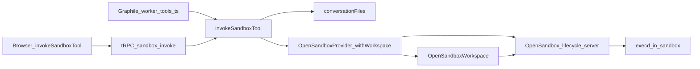

# Sandbox

The **Sandbox** builtin tool (identifier `lobe-sandbox`, formerly the Code
Interpreter `lobe-code-interpreter`) gives the model a Linux container per
conversation on an [OpenSandbox](https://github.com/opensandbox-group/OpenSandbox)
server: bash commands (foreground or background), Python through the runner,
file read/write/edit/list, and export of any sandbox file to the chat.
OpenSandbox is the only backend; the DifySandbox provider was removed together
with `SANDBOX_PROVIDER` and `CODE_INTERPRETER_SANDBOX_URL` / `_API_KEY`.

## Tool APIs

`src/tools/sandbox/` holds the manifest, `systemRole.ts`, the per-API Render,
and `const.ts` (identifiers, API names, `SANDBOX_WORKDIR = /tmp/workspace`).
Every API returns a JSON `SandboxToolResult` (`packages/types/src/tool/sandbox.ts`)
as the tool message content. Failures are `success: false` results, so the
model can retry. A caller abort is the exception: `Cancelled`, or any error
once the worker abort signal is already set, is rethrown. Durable Stop then
does not persist a tool message or start the next assistant turn.

| API | Arguments | Result |
| --- | --- | --- |
| `runCommand` | `command`, `cwd?`, `timeout?` (s), `background?` | `stdout`, `stderr`, `exitCode`, `durationMs`, `timedOut`, `hint`; background: `commandId` |
| `getCommandOutput` | `commandId`, `cursor?` | `running`, `exitCode`, `log` (stdout+stderr), `nextCursor` (byte offset) |
| `stopCommand` | `commandId` | `success` |
| `runPython` (legacy `python`) | `code`, `packages?`, `timeout?` | Code Interpreter shape: `output[]`, `files[]` |
| `readFile` | `path`, `offset?`, `limit?` | `cat -n` lines, `startLine`/`endLine`/`totalLines`, `truncated`; binary: `binary`, `size` |
| `writeFile` | `path`, `content` | `bytes` |
| `editFile` | `path`, `oldString`, `newString`, `replaceAll?` | `replacements`; fails on 0 or >1 matches without `replaceAll` |
| `listFiles` | `path?`, `depth?` (1–5, default 2) | `entries` (max 500), `truncated` |
| `exportFile` | `paths[]` | `files[]` (`fileId`, `filename`, `url`), `skipped` |

Relative paths resolve against `/tmp/workspace`. An absolute path is used as
given. It is a path inside the sandbox container, not on the ChatHub host.
`runCommand` can reach the same places. Arguments are validated with
zod (`src/server/services/sandbox/tool/schemas.ts`), which also accepts numbers
and booleans sent as strings and `null` for omitted values. `timeout` is
seconds; `resolveTimeoutMs` clamps it to `[1s, SANDBOX_MAX_TIMEOUT]` and an
omitted value uses `SANDBOX_TIMEOUT`. `readFile` stops at a line boundary near
100k characters; `stdout`/`stderr` and command logs keep their head and tail
within `SANDBOX_MAX_OUTPUT_CHARS` (`OutputCollector` in `text.ts`).

`exportFile` and `runPython` outputs go through `persistSandboxOutputFiles`,
so `files[].url` has the same shape as before: `fileLinks.ts` rewrites bare
filenames in the follow-up reply, and later calls gather those files as
conversation files.

## Execution paths

- **Worker:** `conversationGeneration/tools.ts` routes any
  `isSandboxToolIdentifier` call to `invokeSandboxTool` with `payload.apiName`
  and the worker's abort `signal`. `findUnsupportedConversationTool` lets the
  Sandbox through, so its presence never defers a turn to the browser.
- **Browser:** `invokeBuiltinTool` (`store/chat/slices/plugin/action.ts`)
  sends every Sandbox API to the single `invokeSandboxTool` store action,
  which calls tRPC `sandbox.invoke` (`server/routers/lambda/sandbox.ts`).
  Store actions are otherwise looked up by API name, which would collide and
  would not cover the legacy `python` name.
- `invokeSandboxTool` (`server/services/sandbox/tool/index.ts`) lists the
  conversation's input refs, then runs one `withWorkspace` task. File and
  command APIs first sync conversation files; `getCommandOutput` and
  `stopCommand` use `createIfMissing: false`, so they fail with `NotFound`
  instead of creating an empty sandbox.

## Legacy identifier

Old tool messages keep `lobe-code-interpreter` and API `python`.
`resolveBuiltinToolAlias`, `isSandboxToolIdentifier`, and
`resolveSandboxApiName` (`src/tools/sandbox/const.ts`) cover them in the
renders map, `getMetaById`, the tool inspector title, conversation-file
gathering, file-link rewriting, the builtin-identifier set used for memory
taint, and both dispatch paths. Plugin lists are normalized on read
(`normalizeBuiltinToolIds` in the agent plugin selector and in the server
payload builder; it returns the same array when nothing changes, so selectors
stay referentially stable). Migration `0062_sandbox_tool_identifier` rewrites
`agents.plugins` and `user_settings.default_agent.config.plugins`, keeping
order and one entry when both ids were present.

## Provider interface

`src/server/services/sandbox/types.ts`:

- `SandboxProvider`: `id`, `isConfigured()`, `keepsSessions` (idle timeout
  > 0), and `withWorkspace(options, task)`. Options: `budgetMs` (longest step;
  sizes the TTL), `sessionKey`, `createIfMissing`, `enableNetwork`, `signal`,
  and debug-only `apiName` / `operationHash`.
- `SandboxWorkspace` (one sandbox for the task): `exec`, `startBackground`,
  `commandStatus`, `commandLogs`, `interrupt`, `readFile`, `writeFile`,
  `fileInfo`, `listDirectory`, `syncInputs`, `markSynced`, `runPython`,
  `fresh`, `workdir`.
- `SandboxError` codes: `NotConfigured`, `NotFound`, `Timeout`, `Cancelled`,
  `Unavailable`, `Unauthorized`, `ExecutionFailed`. `SandboxRequestError`
  (an `ExecutionFailed`) means execd answered but the request failed: a
  missing file, a directory where a file was expected, an unknown command id,
  a bad cwd. execd reports those as 4xx or 500; 502–504 come from the server
  proxy when execd is gone.

**Keep or delete.** After a task, a session sandbox is parked. After a
failure it is kept only for `SandboxRequestError`, `Timeout`, and `Cancelled`;
anything else (unreachable server, a stream that ends without a result, an
unexpected response) deletes it so the next call starts fresh. A caller abort
interrupts the running foreground command (its id comes from the stream's
`init` event) before the error surfaces as `Cancelled`. `invokeSandboxTool`
rethrows that error. It also throws `Cancelled` when the caller signal is
already aborted, including when output collection or the sync-record upload
swallowed the abort and resolved. The worker does not store that call as a
tool result.

`getSandboxProvider()` always returns `OpenSandboxProvider`; without
`OPENSANDBOX_SERVER_URL` and `OPENSANDBOX_IMAGE` every call fails with
`NotConfigured` and ChatHub still boots.

## Conversation files

`conversationFiles.ts` is ChatHub-side, not provider-specific:

1. Page `MessageModel.query` **newest-first** (`order: 'desc'`, `pageSize`
   1000) until the file cap is filled, a short page, or 50 pages.
2. Scope with `loadConversationThreadMessages` (unset `threadId` = main topic
   only; a portal thread is that thread plus its main prefix, not sibling
   threads).
3. Walk **newest → oldest**. Duplicate basenames keep the newest file.
   `listConversationSandboxInputs` returns refs (`id`, `filename`, lazy
   `load()`); bytes are fetched only for files the sandbox has not received
   (see *File sync*).
4. Persist outputs with `FileService.uploadBytes` and the file's MIME type
   (`application/pdf` for a PDF; image plots stay `image/png`). Do not use
   `uploadMedia`: it only accepts image extensions and drops PDF, docx, xlsx,
   and pptx. The open URL is `getFullFileUrl` when `S3_PUBLIC_DOMAIN` or
   `S3_SET_ACL` is set, and `getUIFileUrl` (`/webapi/files/...`) otherwise. A
   presigned URL is not saved into the topic. The tool card copies that open
   URL and downloads through the file id proxy. The follow-up assistant reply
   rewrites a bare filename, a relative filename link, or the same filename on
   the app origin. Links to other sites, code blocks, and longer names such as
   `report.pdf.zip` stay unchanged.
   A failed file is logged (`sandbox_persist_skipped`) and skipped; the run
   continues. Older messages without `url` still resolve via `file.findById`.
5. The builtin tool card defaults to plugin UI (not JSON). File cards use
   `downloadFile` (fetch blob + object URL) because browsers ignore
   `<a download>` on cross-origin S3 URLs.

### File sync

The sandbox records the conversation file ids it holds in
`/tmp/workspace/.chathub/synced.json`. Each call uploads only refs whose id is
not in it (newest first, one per basename), in the same multipart upload as
the updated record, so bytes are loaded from S3 only for new files. A file
the model edited in the sandbox is not overwritten by a later call, and a
deleted copy is not restored. `runPython` and `exportFile` add the ids of the
files they persisted (`markSynced`), so outputs are not uploaded back. A new
sandbox skips the record download and receives every ref. A missing or
unreadable record counts as empty.

## OpenSandbox

`src/server/services/sandbox/providers/opensandbox/` drives the lifecycle
server over plain HTTP (no SDK dependency): `client.ts` (endpoints),
`provider.ts` (lifecycle), `workspace.ts` (operations), `python.ts` (runner).
Each `withWorkspace` call:

1. Reuses the conversation's running sandbox (see *Session sandboxes*), or
   `POST /v1/sandboxes` with `OPENSANDBOX_IMAGE`, entrypoint
   `tail -f /dev/null` (the server injects execd), CPU/memory caps, labels
   `chathub-session`, `chathub-network`, `chathub-runtime`, and
   `name=chathub-sandbox`, and a TTL of ready + call budget + 120s so the
   server reaps a sandbox ChatHub failed to delete.
2. Polls the sandbox to `Running`, resolves execd (port `44772`) with
   `use_server_proxy=true`, then polls execd `/ping`: `Running` only means
   the container started, and the proxy answers 502 until execd listens.
3. Runs the task against an `OpenSandboxWorkspace`.
4. In `finally`, parks a session sandbox for the next call, or deletes it.

execd endpoints used (checked against `specs/execd-api.yaml` and the Go
source at tag `docker/execd/v1.1.0`):

| Operation | execd call | Notes |
| --- | --- | --- |
| Foreground command | `POST /command` `{command, cwd, timeout}` (SSE) | `bash -c`; `init` event carries the command id |
| Background command | `POST /command` `{background: true}` | sends `init` then `execution_complete` at once; the process outlives the request (`context.Background()`) |
| Status | `GET /command/status/{id}` | `running`, `exit_code`, `error`; unknown id → 404 |
| Logs | `GET /command/{id}/logs?cursor=` | plain text, combined stdout/stderr; cursor is a **byte** offset, next one in `EXECD-COMMANDS-TAIL-CURSOR`; unknown id → 400 |
| Stop | `DELETE /command?id=` | SIGTERM then SIGKILL to the process group; not running → 500 |
| Read | `GET /files/info?path=` then `GET /files/download?path=` | info first, so a directory or an over-cap file is a clear error instead of a 500 |
| Write | `POST /files/upload` (metadata + file parts) | creates parent dirs; applies `mode` (kept from `/files/info` for an existing file, else 644) |
| List | `GET /directories/list?path=&depth=` | does not follow symlinks; ChatHub caps the body at 4 MiB and the result at 500 entries |

`/files/search` is not used: its glob matches basenames only and walks
everything, including `node_modules`. The model uses `rg --files` or `find`
through `runCommand` instead.

**Python runner.** `runPython` uploads `.chathub/run.py` (runner),
`.chathub/code.py` (user code), an empty `.chathub/manifest.json`, and any new
conversation files in one multipart upload, then runs the fixed string
`python3 /tmp/workspace/.chathub/run.py` with `timeout` = the call budget.
User code reaches the sandbox only as a file. It then downloads the manifest
(name, size, sha256, and whether this run created or changed each top-level
file) and only those files, each read in chunks and rejected once it passes a
finite cap (`OPENSANDBOX_MANIFEST_MAX_BYTES`, or `SANDBOX_MAX_FILE_BYTES` for
a file). A `Content-Length` above the cap cancels the body before it is read.
Best effort: a missing manifest, an over-cap body, or a failed download keeps
stdout/stderr and returns no files. A `runPython` timeout returns only the
timeout error; a `runCommand` timeout returns the output so far.

### Session sandboxes

Calls in one conversation share a sandbox, so files, installs, and background
processes from one call are there for the next. The conversation scope is the
one input files are gathered from: user, agent or group (the inbox counts as
none), topic, and portal thread, so an agent's messages outside any topic are
a scope too. `buildSandboxSessionKey` (`sandbox/session.ts`) hashes it to 32
hex chars, and the sandbox carries it as the `chathub-session` label. ChatHub
keeps no mapping of its own:
`GET /v1/sandboxes?metadata=chathub-session=<key>&state=Running` finds the
sandbox again after a ChatHub restart.

- **Before a call**, a found sandbox is renewed to now + call budget + 120s
  (`POST /v1/sandboxes/{id}/renew-expiration`; the ready budget is not
  included) and must answer execd `/ping` within 5s. One that does not is
  deleted, and the call creates a new one. A lookup error other than the
  ready-budget abort falls back to a new sandbox. If the lookup itself hits
  `OPENSANDBOX_READY_TIMEOUT`, the call fails.
- **Replaced on change.** A sandbox is replaced when its `chathub-network`
  label is not the fingerprint of the policy this call would send (`open`
  when there is no policy; a sandbox without the label is replaced as soon as
  a policy is configured), or when its `chathub-runtime` label is not the
  hash of the current `OPENSANDBOX_IMAGE` plus `OPENSANDBOX_LAYOUT_VERSION`
  (a sandbox without it, e.g. a Code Interpreter one on `/tmp/chathub-ci`, is
  replaced too). CPU and memory changes still wait for the next sandbox.
- **After a call**, the sandbox is renewed to the idle deadline
  (`OPENSANDBOX_SESSION_IDLE_TIMEOUT`, default 30 min) and the server reaps
  it if no call comes. Every call restarts the timer. See *Keep or delete*
  for failures.
- **What carries over:** files, installed packages, and background
  processes. Python variables and imports do not: every `runPython` is a new
  `python3` process. A background process ends when the sandbox is reaped.
- **Optional max lifetime.** `OPENSANDBOX_SESSION_MAX_LIFETIME` (default 0,
  off) caps a sandbox's age even while its conversation is active. With it
  set, ChatHub never renews a sandbox past `createdAt` + the cap. A sandbox
  with less than one call budget left, or with no `createdAt`, is deleted
  instead of reused.
- **Outputs.** The runner stamps the size and mtime of the top-level files
  before the user code runs, and the manifest lists only files this run
  created or changed. ChatHub uploads an empty manifest before the process
  starts, so an abrupt exit publishes no previous files. `plot_N.png`
  numbering continues after the plots already in the workdir.
- **Concurrency.** Calls with the same key take turns inside one ChatHub
  process (a per-key promise chain), so two tool calls in one turn neither
  create two sandboxes nor share the workdir mid-call.
- `OPENSANDBOX_SESSION_IDLE_TIMEOUT=0` restores one fresh sandbox per call;
  background commands are then refused. `sandbox_run_settled` logs
  `operation` (the API name), `sessionScoped`, `sandboxReused`,
  `sandboxRetired`, `sandboxLookupFailed`, `fileInCount`, and `fileOutCount`.

### Create TTL and renew

OpenSandbox has two lifetime calls. `max_sandbox_timeout_seconds` applies to
only one of them. Checked against server commit `c7dc78a`.

| Call | Body | Checked against the limit? |
| --- | --- | --- |
| `POST /v1/sandboxes` | `timeout` seconds | Yes. `create_sandbox` calls `ensure_timeout_within_limit` (`docker_service.py` 635-638). `validators.py` 187 returns HTTP 400 only when `timeout_seconds > max`. Exactly 3600 is accepted. |
| `POST /v1/sandboxes/{id}/renew-expiration` | `expiresAt` | No. `renew_expiration` (`docker_service.py` 1328-1369) calls `ensure_future_expiration` (`validators.py` 133-154), which only requires a future time. |

`config.py` 608-615 says the setting does not apply to renew and does not cap
total lifetime. Omitting the config line sets the limit to `None`, and
`validators.py` 184-185 then skips the check.

ChatHub always sends `timeout`. A new sandbox uses
`ceil((OPENSANDBOX_READY_TIMEOUT + call budget) / 1000) + 120`
seconds, and at least 60. The call budget is the call's time limit
(`SANDBOX_TIMEOUT`, or the model's `timeout` up to `SANDBOX_MAX_TIMEOUT`) for
`runCommand` / `runPython`, and 60s for file and command-metadata calls.
Defaults are 60s + 60s + 120s = 240s, which is under 3600. After the call, renew sets `expiresAt` to now plus
`OPENSANDBOX_SESSION_IDLE_TIMEOUT`. A later call in that chat renews first to
now plus its budget plus 120s, then renews to the idle deadline again
after the call. With the default 60s ready budget, a call budget
above 3420000 ms makes the create TTL greater than 3600s and every create
returns HTTP 400. Raise `max_sandbox_timeout_seconds`, or remove the line.
Keep 3600 otherwise: it blocks other API clients from creating a long-lived
sandbox, and it does not shorten a ChatHub sandbox.

A create that omits `timeout` skips the cap. `_build_labels_and_env`
(`container_ops.py`) labels that sandbox for manual cleanup, startup does not
schedule an expiry, and it never expires. Renew of that sandbox is HTTP 409.
ChatHub does not use that path. The smoke-test script, the OpenSandbox SDK,
and the CLI can.

Renew writes the new expiry to `~/.opensandbox/metadata` inside the server
container (`metadata.py`, `Path.home()`; the image has no `USER`, so
`/root/.opensandbox`) and tries to update the container label. Docker container
update does not change labels; the server logs a warning and keeps the file.
`docker restart` of the same container keeps the file. Recreating the
container loses it unless `/root/.opensandbox` is a volume. Startup then
deletes sandboxes whose label still has the short create TTL. The operator
page mounts `./opensandbox/data:/root/.opensandbox`.

The runner `exec`s the code as `__main__`, echoes a trailing expression with
`repr()` like a notebook, maps `SystemExit` like a script (0/`None` succeed),
prints tracebacks without runner frames (source lines via `linecache`),
forces `MPLBACKEND=Agg`, and patches `plt.show()` on pyplot import to save
`plot_N.png`. Unshown figures are flushed before the manifest.

Absolute writes stay on the real path. `builtins.open`, `io.open`, and
`os.open` create a missing parent for a write outside `/tmp/workspace`,
except paths under `/dev`, `/proc`, and `/sys`. They do not remap reads,
`stat`, or `unlink`, so a later delete and a child process see that file.
After the user code finishes, a captured file that still exists is copied
into the workdir under its basename only when its last successful content
change is newer than the workdir file's. The path is resolved with
`os.path.abspath` at open time, so a later `chdir` does not attribute a
nested file to the workdir root. A failed open or a read does not advance
that sequence; `write` on an already-open handle does. An equal sequence
keeps the workdir file. A newer absolute path still replaces an untouched
input file. A file that was removed, including tempfile probes, is not copied. The manifest still lists only top-level
regular files, and it skips symlinks, dot names, `fontlist-v*`, and
`*.matplotlib-lock`.

`STSong.ttf` in the workdir is a symlink to
`/usr/share/fonts/truetype/STSong.ttf`. The image points that path at the
WenQuanYi collection. ReportLab 5.0.1 treats the `ttcf` scaler (`0x74746366`)
as a collection and embeds subfont 0 (`TTFontParser.ttfVersions` /
`readTTCHeader` in `pdfbase/ttfonts.py`), so the file is not extracted to a
single-face TTF. The symlink is not returned as a chat file.

execd's command stream sends one event per output line (newline stripped),
`execution_complete` on exit 0, and an `error` event whose `evalue` is the
exit code otherwise. A signal death is `evalue` `-1` (`signal: killed`): at
or past the run timeout it is a `Timeout`, earlier it is a failed run with a
likely-out-of-memory note. A stream that ends with neither is
`ExecutionFailed`. The client aborts 5s after the run timeout as a backstop.

**Why not Jupyter.** The first version ran cells in an execd Jupyter context.
execd opens a new kernel websocket for every cell and matches replies by
message type only, and its code streams stayed open until the timeout in
roughly 1 of 6 local runs (setup and user cells alike, servers `1.1.0` and
`1.1.1-rc.1`). A raw-HTTP harness reproduced it without ChatHub: a
`print('done')` cell stayed open 593s, kept alive by execd `ping` events, so
no socket timeout fires. The command API has no kernel, removes the Jupyter boot from
every run (~6s → ~2s locally), and works with any image that has `python3`.
Interpreter state does not carry over either way: each run is a new process,
and a session sandbox keeps files and installs, not variables.

**Image.** `docker/opensandbox/` builds `chathub-sandbox:1` on
`python:3.12-slim-trixie`: the pinned data/office libraries, CJK fonts and the
`STSong.ttf` path the runner links into the workdir, Node.js 24 LTS copied
from `node:24-trixie-slim` (same Debian release, so the binary matches glibc)
with npm, corepack, pnpm, and yarn, plus git (system identity
`ChatHub Sandbox`), build-essential, curl, wget, jq, ripgrep, sqlite3,
zip/unzip, xz, procps, file, less, and openssh-client. `WORKDIR` is
`/tmp/workspace`. The official `opensandbox/code-interpreter` image has no
numpy, pandas, or matplotlib, and its Pythons are only on `PATH` via its
entrypoint.

`OPENSANDBOX_EGRESS_ALLOW` sends a deny-by-default `networkPolicy`; that needs
the egress sidecar (runc or Kata, not gVisor) **and** `[docker] network_mode =
"bridge"` — the server rejects a policy on a user-defined network with
HTTP 400. Use egress `mode = "dns+nft"` for packet-level default-deny; plain
`dns` only filters names. Without a policy, outbound control is the host
firewall. The allowlist path is untested here: the sidecar could not start in
the verification sandbox (no IPv6 sysctls in its kernel).

Operator constraints worth knowing before deploying:

- The lifecycle server mounts the Docker socket (root-equivalent on the host).
  Keep its port unpublished.
- The `/sandboxes/{id}/proxy/{port}` route skips API-key auth in single-tenant
  mode, and execd has no token in Docker mode (`secureAccess` is Kubernetes
  only). Server `1.1.0` publishes every sandbox's execd port on `0.0.0.0`;
  `[docker] publish_host` arrives in `1.1.1`. Put sandboxes on their own
  bridge with ICC off and drop sandbox-subnet traffic to private ranges and
  the host, or one sandbox can reach another's execd through the host port
  (reproduced locally, and closed by those rules).
- Server `1.1.0` defaults `[docker] network_mode` to `host`; set it.
- On `1.1.1` or later, set `[docker] publish_host` (`127.0.0.1` when the
  server runs on the host, the bridge gateway when it runs in a container) so
  execd ports are not published on every interface. ChatHub needs no change:
  it reaches execd only through the server proxy.
- execd `1.1.0` rejects the spec's `argv` command field; ChatHub sends
  `command`.

Verified end to end with runc against `opensandbox/server:release-1.1.0` and
`release-1.1.1-rc.1` (live suite 56/56 runs, raw command API 125/125, no
leftover sandboxes); Kata and gVisor were not available there. Session
sandboxes were verified against `release-1.1.0` and `release-1.1.1-rc.1`
with `max_sandbox_timeout_seconds = 3600` (live suite 9/9 on each): a
subprocess install and a workdir file reached the next run; with a max
lifetime set, a parked sandbox's `expiresAt` was its `createdAt` + the cap
and a sandbox past it was replaced; and the server purged an expired
sandbox and dropped it from the metadata list. On
`release-1.1.1-rc.1` with `max_sandbox_timeout_seconds = 3600`, a create
asking for 86400s returned HTTP 400 and a renew to now + 1 day returned
HTTP 200. Those runs predate the Sandbox tool and used the Python runner
only.

The workspace operations were verified against local
`opensandbox/server:release-1.1.0` and `release-1.1.1-rc.1` with runc (live
suite, test *runs shell commands, background processes, and file operations
in one sandbox*): exit codes and stderr, partial output on a timeout, a
background Node server with logs, cursor, fetch, and stop, an unknown command
id kept the sandbox, file write/list/info/read, and a missing file, all in one
session sandbox. On `release-1.1.1-rc.1` (with `publish_host = "127.0.0.1"`)
the suite ran 7 times, including right after a server restart and under full
CPU load. Both releases default to `opensandbox/execd:v1.1.0`, and their
lifecycle and execd specs differ only in fields ChatHub does not use
(snapshot `env`, the Jupyter interrupt wording). One early run failed once:
the background Node server had not printed `ready` within a fixed 1.5s wait
while the host's Docker daemon was slow (a label update took 1.3s instead of
~20ms). The live test now polls for that state instead of sleeping. The
image's apt layer could not be built in that environment (Debian mirrors
blocked), so the image-tool and CJK-font live tests need a host with Debian
mirror access.

## Configuration

| Variable | Default | Meaning |
| --- | --- | --- |
| `OPENSANDBOX_SERVER_URL` | — | Lifecycle server base URL. Required. |
| `OPENSANDBOX_API_KEY` | — | Sent as `OPEN-SANDBOX-API-KEY`; the proxy strips it before execd. |
| `OPENSANDBOX_IMAGE` | — | Sandbox image (`chathub-sandbox:1`). Required. |
| `OPENSANDBOX_CPU` / `OPENSANDBOX_MEMORY` | `1` / `2Gi` | Per-sandbox caps. |
| `OPENSANDBOX_READY_TIMEOUT` | 60000 | Create + execd ready budget (ms). |
| `OPENSANDBOX_EGRESS_ALLOW` | — | Deny-by-default domain allowlist. |
| `OPENSANDBOX_SESSION_IDLE_TIMEOUT` | 1800000 | Keep a conversation's sandbox this long after its last call (ms); 0 = fresh per call. |
| `OPENSANDBOX_SESSION_MAX_LIFETIME` | 0 | Optional age cap (ms). |
| `SANDBOX_TIMEOUT` | 60000 | Default per-call time limit (ms). Legacy `CODE_INTERPRETER_TIMEOUT`. |
| `SANDBOX_MAX_TIMEOUT` | 600000 | Largest `timeout` the model may request (ms). |
| `SANDBOX_MAX_FILE_BYTES` | 10 MiB | Per-file cap for inputs, reads, writes, exports. Legacy `CODE_INTERPRETER_MAX_FILE_BYTES`. |
| `SANDBOX_MAX_FILE_COUNT` | 20 | Conversation files per sync and files per export. Legacy `CODE_INTERPRETER_MAX_FILE_COUNT`. |
| `SANDBOX_MAX_OUTPUT_CHARS` | 30000 | stdout / stderr / log characters per call, head + tail. Legacy `CODE_INTERPRETER_MAX_STDOUT_CHARS`. |

`src/envs/sandbox.ts` reads each `SANDBOX_*` name first and the legacy
`CODE_INTERPRETER_*` name when it is unset.

## Prompt layering

The builtin Sandbox `systemRole` (`src/tools/sandbox/systemRole.ts`) is the
**product-level sandbox contract** only: the working directory, what carries
over between calls, the tools the image usually has (check with
`command -v`), time limits, when to use the file APIs and background
commands, how to deliver files (`files[].url`), and the Python guidance
(matplotlib Agg and `plot_N.png`, prefer office/data libraries **when
installed**, STSong for Chinese PDFs). The `packages` argument does not
install anything; `pip`/`npm` installs are best-effort and last only while
that sandbox lives. Keep it static text (prompt-cache prefix). Do not add
operator-specific jobs there.

| Need | Where |
| --- | --- |
| Extra preinstalled packages or CLIs | `docker/opensandbox/` (requirements or apt list), then rebuild the image. An install in a call is best-effort and is not a substitute |
| Standing specialty | That assistant’s system prompt (Agent Setting) |
| One-off task | User message or a Skill — topics have **no** system-prompt field |
| ChatHub LLM API keys | Stay on the ChatHub container; they are **not** injected into the sandbox |

Agent rule: `.cursor/rules/sandbox-prompt.mdc`.

User-facing setup:
[Code Interpreter with OpenSandbox](https://github.com/lqdflying/chathub/wiki/Code-Interpreter-with-OpenSandbox).
